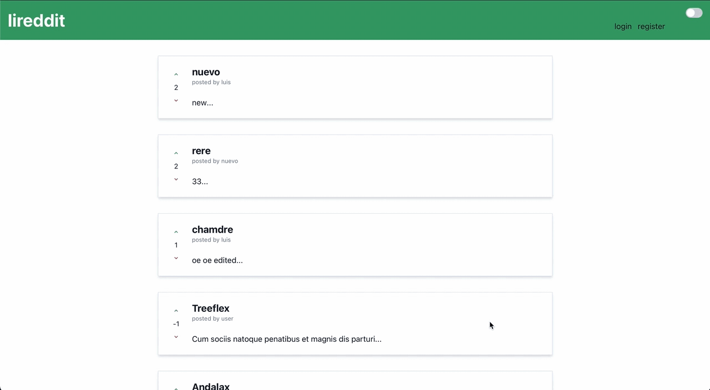

# Fullstack reddit

Frontend: `React` `Next.js` `URQL/Apollo` `Typescript` `Chakra ui`
  
Backend: `Node.js` `Graphql` `Redis` `Postgresql` `MikroORM/TypeORM` `TypeGraphQL` `Express` ...
  
Docker image: docker pull luisadrian/lireddit:1
  

